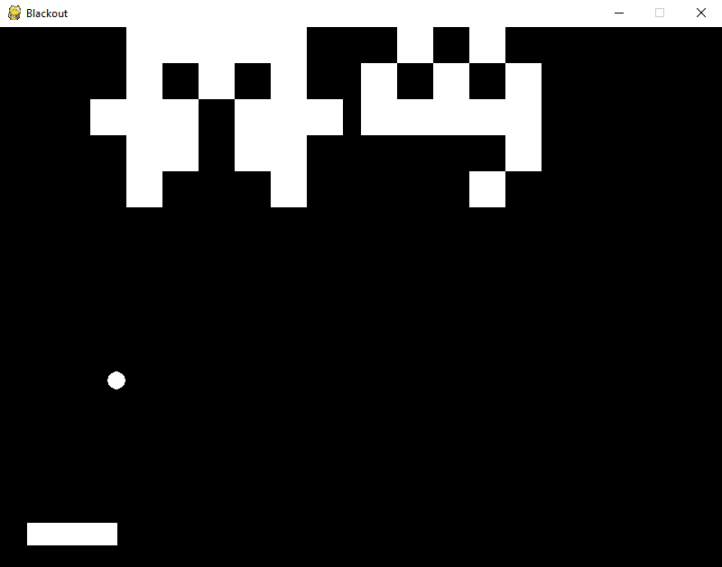

# O que é Breakout?
É um jogo que consinsiste em uma bola que destroi os blocos na tela enquanto o jogador controla uma raquete que deve impedir a bola de colidir com a parte inferior da tela.

## Como jogar
Para jogar é necessário ter tanto o python 3 quanto a pygame instalados. Depois basta executar o arquivo Main.py contido na pasta game.

## O que foi implementado
* O jogo possui uma série de fases, entretando ainda **não** foi adicionado uma fase final. Assim quando terminar todas as fases, o jogo irá fechar.
* Uma tela de pause pode ser acessada através da tecla **p**: o botão **continue** retorna ao jogo e o botão **quit** fecha o jogo.
